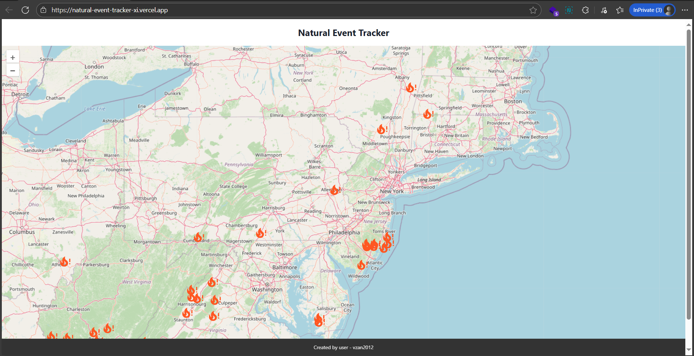

# 🌍 Natural Event Tracker | React + NASA EONET API

[](https://natural-event-tracker-xi.vercel.app/)
[](https://react.dev/) [](https://vitejs.dev/)

A high-performance dashboard tracking **wildfires, storms, and volcanic activity** using NASA’s [EONET API](https://eonet.gsfc.nasa.gov/). Built with **React 19, Vite, and TanStack Query** for optimized data fetching.



## 🛠 Tech Stack

- **Core**: React 19 (Hooks), Vite
- **Data Fetching**: TanStack Query (Caching, Background Updates)
- **Maps**: Pigeon Maps (Lightweight OSM alternative)
- **Styling**: Chakra UI (Responsive), Framer Motion (Animations)
- **Deployment**: Vercel (Serverless)

## ✨ Key Features

✔ **Real-time Event Map** – Interactive markers with clickable details  
✔ **Efficient Data Fetching** – TanStack Query minimizes API calls  
✔ **Responsive Design** – Mobile-friendly with Chakra UI  
✔ **Lightning Fast** – Vite-powered builds

## 🚀 Why This Stands Out

- **Production-Grade Data Handling**:
  - Automatic caching/background updates via TanStack Query
  - No unnecessary re-fetches (staleTime optimization)
- **Modern Architecture**:
  - Custom hooks for API logic separation
  - Environment-based API configuration

## 📂 Installation

To execute the project in your local machine

1. First, open the terminal clone the project

   ```bash
   git clone https://github.com/vzan2012/natural-event-tracker.git
   cd natural-event-tracker
   ```

2. Next open **.env** file, add the NASA API link,

   ```javascript
   VITE_NASA_EONET_URL = "https://eonet.gsfc.nasa.gov/api/v3";
   ```

3. Perform install &amp; run the vitejs server
   ```bash
   npm install
   npm run dev
   ```
4. Access the Web browser to open the site,
   ```
   http://localhost:5173
   ```
