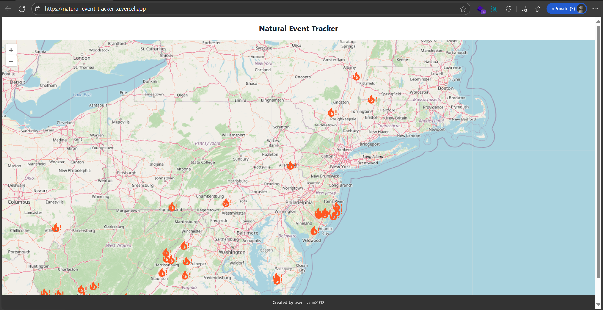

# 🌍 Natural Event Tracker | React + NASA EONET API

[](https://natural-event-tracker-xi.vercel.app/)
[](https://react.dev/) [](https://vitejs.dev/)

A high-performance dashboard tracking **wildfires, storms, and volcanic activity** using NASA’s [EONET API](https://eonet.gsfc.nasa.gov/). Built with **React 19, Vite, and TanStack Query** for optimized data fetching.



## 🛠 Tech Stack

- **Core**: React 19 (Hooks), Vite
- **Data Fetching**: TanStack Query (Caching & Persistance)
- **Maps**: Pigeon Maps + Supercluster (Marker Clustering)
- **Styling**: Chakra UI & Iconify
- **Testing**: Vitest - Testing Library
- **Deployment**: Vercel (Serverless)

## ✨ Key Features

✔ **Real-time Event Map** – Interactive markers with clickable details  
✔ **Marker Clustering** – Supercluster groups nearby events for better map performance
✔ **Cache Persistance** - Updated data saved to localStorage - survives page refresh & API downtime
✔ **Responsive Design** – Mobile-friendly with Chakra UI  
✔ **Test Suite** – Unit and component tests with Vitest testing library

## 🚀 Why This Stands Out

- **Production-Grade Data Handling**:
  - Automatic caching/background updates via TanStack Query Persister
  - Auto-retry on API failure with staleTime optimization
  - Deferred cluster calculation keeps UI non-blocking
- **Clean Architecture**:
  - Shared constants eliminate code duplication following DRY concepts
  - Environment-based API configuration
- **Testing**:
  - Used Vitest testing library

## 📂 Installation

To execute the project in your local machine

1. First, open the terminal clone the project

   ```bash
   git clone https://github.com/vzan2012/natural-event-tracker.git
   cd natural-event-tracker
   ```

2. Next open **.env** file, add the NASA API link,

   ```javascript
   VITE_NASA_EONET_URL = "https://eonet.gsfc.nasa.gov/api/v3";
   ```

3. Perform install &amp; run the vitejs server
   ```bash
   npm install
   npm run dev
   ```
4. Access the Web browser to open the site,
   ```
   http://localhost:5173
   ```

## 🌐 Live Deployment

The application is continuously deployed via Vercel:  
🔗 **[https://natural-event-tracker-xi.vercel.app/](https://natural-event-tracker-xi.vercel.app/)**

---

👨💻 **Maintained by**: [Deepak Guptha Sitharaman](https://github.com/vzan2012)  
📜 **License**: [MIT](LICENSE.md)  
🔄 **Version**: 1.0.0
